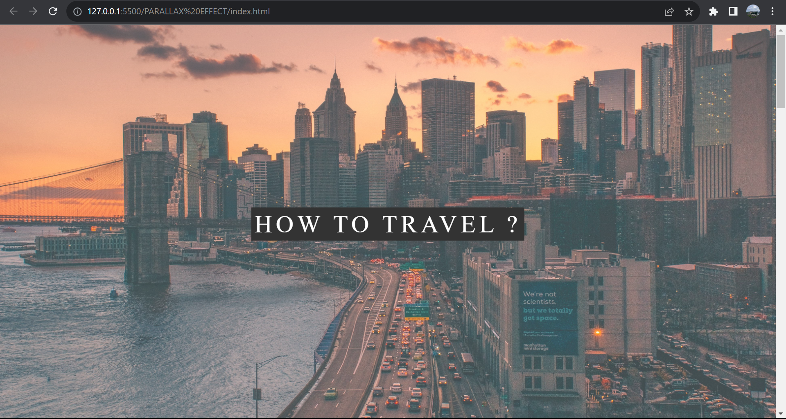
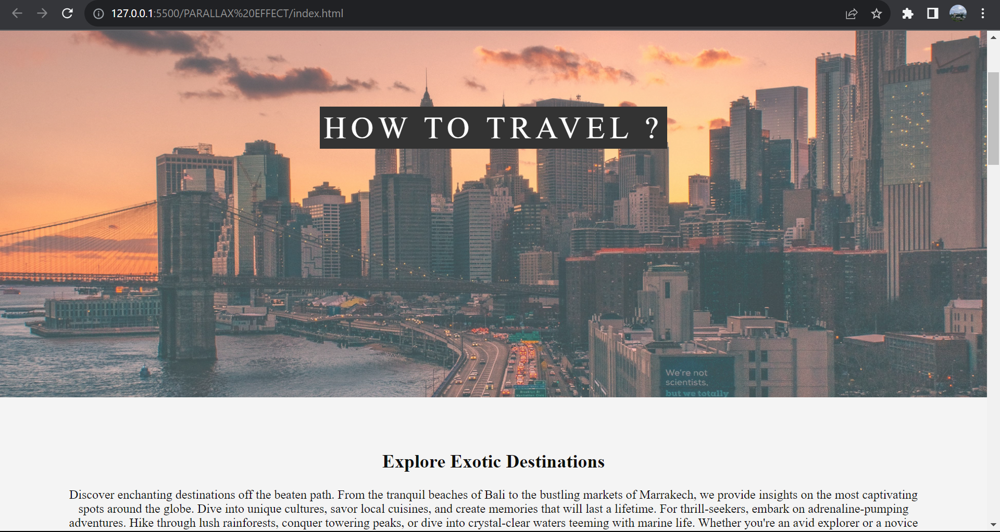
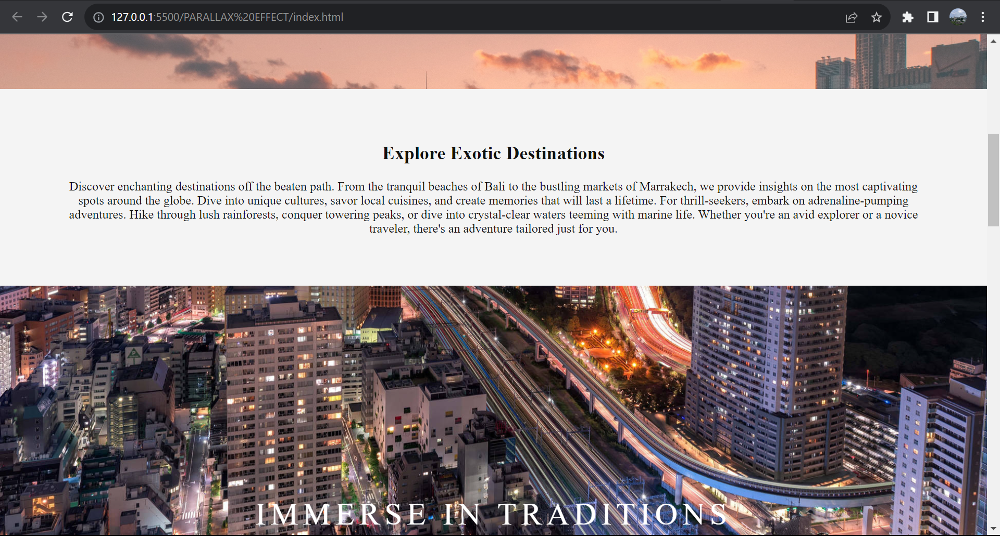
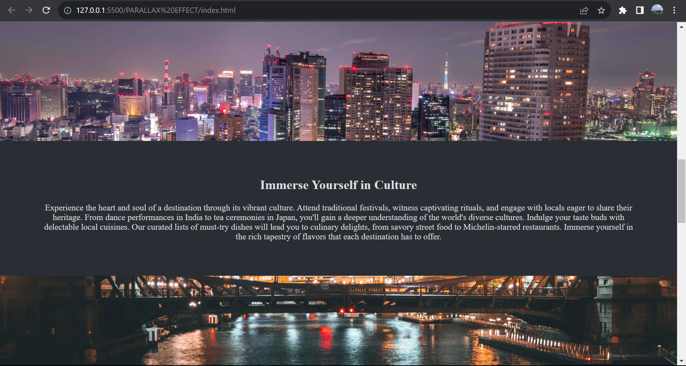
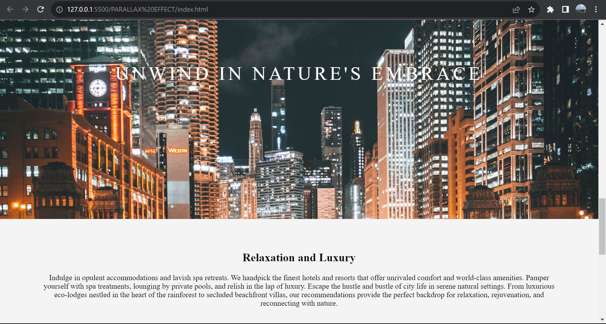

## PARALLAX EFFECT  

A parallax effect on a website creates a dynamic and immersive user experience by moving background elements at different speeds as users scroll. This visual technique adds depth to the design, enhancing engagement and providing a modern, captivating feel to the website.

## Screenshots of Parallax Effect website :- 

